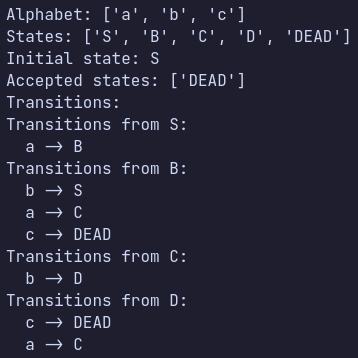
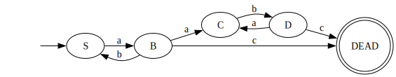
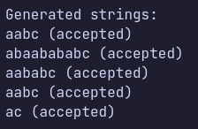
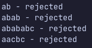

# Intro to formal languages. Regular grammars. Finite Automata.

### Course: Formal Languages & Finite Automata

### Author: Daniela Vornic

---

## Theory

Formal languages provide a framework for understanding how languages, in the broadest sense, are structured and processed. At its core, a formal language is defined by an alphabet, which is a finite set of symbols, and a set of strings formed from these symbols that are considered valid according to specific rules, known as the grammar of the language. Regular grammars, a subset of formal grammars, restrict the form of production rules and are powerful enough to describe numerous natural and artificial languages, though they cannot capture the complexities of all languages.

A grammar `G` is typically defined as a tuple `G = (V_N, V_T, P, S)`, where:

- `V_N` is a finite set of non-terminal symbols.
- `V_T` is a finite set of terminal symbols.
- `P` is a finite set of production rules, each rule transforming a string of symbols into another string.
- `S` is the start symbol, a special non-terminal symbol from `V_n` used to begin the generation of strings.

A regular grammar is a type of formal grammar that generates regular languages, which are a subset of the class of formal languages. They can be of two types: right-linear grammars and left-linear grammars. A right-linear grammar has production rules of the form `A → aB` or `A → a`, where `A` and `B` are non-terminal symbols, `a` is a terminal symbol, and `→` denotes the transformation. A left-linear grammar has production rules of the form `A → Ba` or `A → a`, with the same symbols and transformation notation.

Regular languages can be recognized by finite automata, which are abstract machines that process input strings symbol by symbol and can produce outputs based on a set of internal states and transition rules.

A finite automaton `FA` can be defined as a tuple `FA = (Q, Σ, δ, q_0, F)`, where:

- `Q` is a finite set of states.
- `Σ` is a finite set of input symbols (alphabet).
- `δ` is the transition function `δ: Q × Σ → Q`, defining the transitions between states based on input symbols.
- `q_0` is the initial state, an element of `Q`.
- `F` is the set of accept states, a subset of `Q`.

The process of converting a grammar into a finite automaton involves translating the components of the grammar (non-terminal and terminal symbols, production rules, and the start symbol) into the components of a finite automaton (states, alphabet, transition function, initial state, and accept states).

## Objectives:

- Implement a class for the grammar;
- Add one function that would generate 5 valid strings from the language expressed by the given grammar;
- Implement a functionality that would convert and object of type Grammar to one of Finite Automaton;
- Add a method for the Finite Automaton that checks if an input string can be obtained via the state transition from it;

## Implementation description

### Grammar Class Implementation

The `Grammar` class serves as the foundation for defining formal grammars with non-terminals, terminals, production rules, and a start symbol. Key functionalities include string generation and grammar type identification.

The `generate_string` method is designed to generate strings that conform to the grammar's rules. It is a recursive function that expands a given symbol into a sequence of terminal symbols, which collectively form a string in the language defined by the grammar. It starts with a given non-terminal symbol (defaulting to the start symbol of the grammar) and recursively replaces it with the symbols from the right-hand side of its production rule. This process continues until terminal symbols are reached or the maximum allowed length of the string is exceeded, preventing infinite loops in case of recursive production rules.

```python
def generate_string(self, symbol=None, len=0, max_len=15):
    # Default symbol to start symbol if none provided
    if symbol is None:
        symbol = self.start

    # Prevents infinite recursion by imposing a maximum length for the string
    if len > max_len:
        return ''

    # Directly returns the symbol if it's a terminal
    if symbol in self.terminals:
        return symbol

    # Expands non-terminal symbols based on production rules
    if symbol in self.rules:
        # Chooses a random production rule for the given symbol
        production = random.choice(self.rules[symbol])
        result = ''
        # Recursively generates strings for each symbol in the chosen production
        for sym in production:
            result += self.generate_string(sym, len + 1, max_len)
        return result

    # Returns an empty string if the symbol doesn't match any production rules
    return ''
```

The `get_type` method is crucial for determining whether the grammar is right-linear or left-linear, which is essential for understanding its structure and the types of languages it can generate. It iterates over the production rules of the grammar, checking the arrangement of terminal and non-terminal symbols in each rule. If a rule has a terminal symbol followed by a non-terminal, it is considered right-linear; if the opposite is true, it is left-linear. A grammar with mixed types of rules (both left-linear and right-linear) is not considered regular, and an error is raised. This distinction is vital for the subsequent conversion of the grammar to a finite automaton, as it dictates the structure of the automaton's transitions.

```python
def get_type(self):
    left, right = False, False

    # Flattens the list of production rules to simplify iteration
    rhs = [item for inner_list in self.rules.values() for item in inner_list]

    for right_side in filter(lambda x: len(x) == 2, rhs):
        # Identifies right-linear rules (terminal followed by non-terminal)
        if right_side[0] in self.terminals and right_side[1] in self.non_terminals:
            right = True
        # Identifies left-linear rules (non-terminal followed by terminal)
        elif right_side[0] in self.non_terminals and right_side[1] in self.terminals:
            left = True
        else:
            # Raises an error if the rule doesn't conform to regular grammar conventions
            raise ValueError('Invalid production rule format')

    # Ensures the grammar is either entirely right-linear or left-linear
    if left and right:
        raise ValueError('The grammar is not regular')

    # Determines the grammar's type based on the identified rules
    return 'left' if left else 'right'
```

The `convert_to_fa` method translates a regular grammar into a finite automaton by mapping non-terminals to states, terminals to input symbols, and production rules to transitions. Each non-terminal symbol of the grammar becomes a state in the automaton, and the production rules are translated into state transitions. For right-linear grammars, a production of the form `A → aB` implies a transition from state `A` to state `B` upon reading the symbol a. Similarly, for left-linear grammars, a production `A → Ba` leads to a transition to state `A` from some state corresponding to `B` upon reading `a`. It starts with a `DEAD` state, which is used to handle invalid transitions, and the automaton is deterministic by default.

```python
for non_terminal in grammar.non_terminals:
    transitions[non_terminal] = {}

for non_terminal, productions in grammar.rules.items():
    for production in productions:
        if len(production) == 1:  # Single terminal production
            transitions[non_terminal][production] = final_state
        elif grammar.type == 'right':  # Right-linear production
            transition, new_state = production[0], production[1]
            transitions[non_terminal][transition] = new_state
        elif grammar.type == 'left':  # Left-linear production
            transition, new_state = production[1], production[0]
            transitions[non_terminal][transition] = new_state
```

### Finite Automaton Class Implementation

The `FiniteAutomaton` class encapsulates the concept of a finite automaton. It consists of states, an alphabet, transition functions, an initial state, and accept states, and it is used to recognize patterns within strings.

The `accepts` determines whether a given input string is accepted by the automaton. It simulates the automaton's state transitions based on the input string and checks if the final state is one of the accept states. It sequentially reads each symbol from the input string, transitioning from one state to another according to the defined transition function. If the automaton ends up in an accept state after processing all symbols, the string is accepted; otherwise, it is rejected.

```python
def accepts(self, input_string):
    curr_state = self.initial_state

    for symbol in input_string:
        # The symbol is not in the automaton's alphabet
        if symbol not in self.alphabet:
            return False

        # Check if there's a transition defined for the current state and symbol
        if curr_state in self.transitions and symbol in self.transitions[curr_state]:
            curr_state = self.transitions[curr_state][symbol]
        else:
            return False

    # Check if the current state after processing the input string is an accept state
    return curr_state in self.accept_states
```

Furthermore, the `FiniteAutomaton` class includes a method for visualizing the automaton's structure using Graphviz, a popular graph visualization tool. The `to_graphviz` method generates a visual representation of the automaton's states, transitions, and accept states, which can be exported to various image formats for further analysis and easier understanding of the automaton's behavior.

## Conclusions / Screenshots / Results

This laboratory exercise successfully demonstrated the implementation and functionality of a finite automaton generated from a regular grammar. The `Grammar` class was able to generate strings that conform to the specified rules, while the FiniteAutomaton class evaluated these strings to determine if they were accepted by the automaton. The process of converting a regular grammar into a finite automaton was also implemented, verifying the theoretical concept that regular grammars are equivalent to finite automata. The practical tests conducted with various strings further solidified the understanding of how finite automata process input to determine language acceptance.

The results from Figure 1 depicts the structure of the finite automaton, including its alphabet, states, initial state, accepted states, and transitions. It is observed that the automaton has been constructed with a comprehensive set of transitions between states based on the input alphabet. The presence of a 'DEAD' state indicates a design choice to handle transitions that lead to non-acceptance, effectively illustrating how the automaton processes different inputs.


_Figure 1. Generated finite automaton structure_

The diagram Figure 2 is provides a graphical representation of the finite automaton. Visualizing the automaton is a critical step in understanding its structure and verifying its correctness.


_Figure 2. Diagram of the finite automaton structure_

In Figure 3, we see a list of strings that have been generated and tested against the automaton. Each string is marked as 'accepted', indicating that the `generate_string` method from the `Grammar` class is producing strings that are valid within the language defined by the grammar.


_Figure 3. Generated strings and their acceptance status_

Figure 4 shows several strings that were tested for acceptance by the automaton. The strings 'ab', 'abab', 'abababc', 'aacbc' are marked as 'rejected', which means they do not conform to the language rules as defined by the finite automaton. This reinforces the automaton's capability to discriminate between strings that belong and do not belong to the language.


_Figure 4. Tested strings and their acceptance status_

Overall, the results from the laboratory work validate the theoretical principles of formal languages and automata theory through practical implementation.

## References

1. COJUHARI Irina, DUCA Ludmila, FIODOROV Ion. "Formal Languages and Finite Automata: Guide for practical lessons". Technical University of Moldova.
